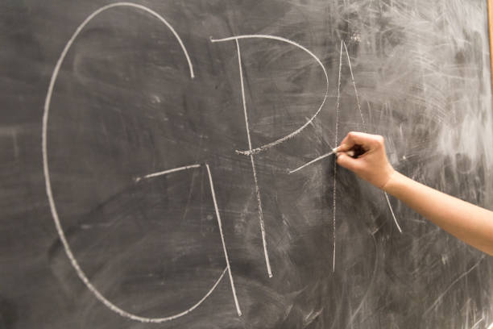

### **Predicting University GPA from SAT Scores**

A university has recently redefined its success metrics, aiming for 70% of its graduates to achieve high GPAs upon completing their studies.

While it's understood that many factors beyond SAT scores can influence a student's GPA (for example, a student may have a lower SAT score but could show exceptional improvement through dedication and hard work), the task at hand is to build a model based on SAT scores. This model will help the university predict which prospective students are likely to achieve high GPAs, potentially boosting the university's ranking.

For this purpose, the **coefficient** and **intercept** of the model will be derived, enabling the university to identify candidates who are more likely to perform well academically, based on their SAT performance.

This is an older project (completed in February 2024) that is now being uploaded to GitHub
